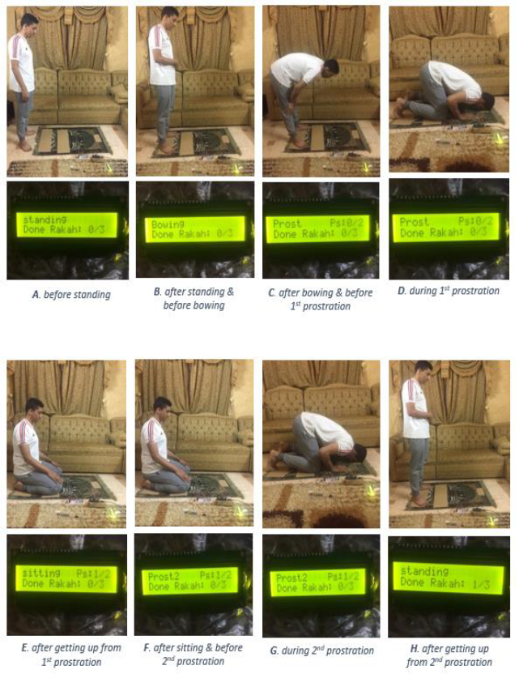
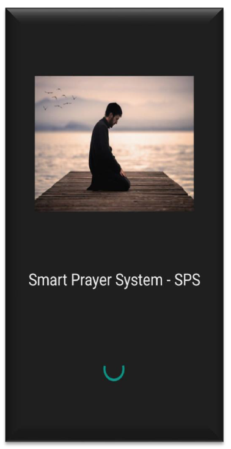
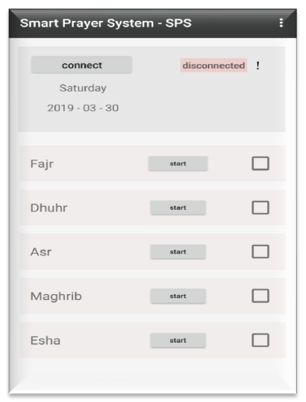
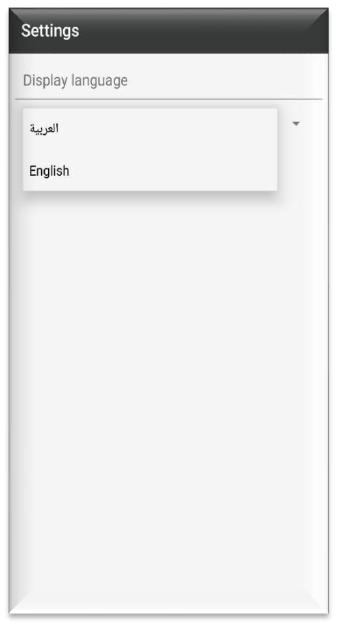

# Smart-Prayer-System
Smart Prayer System (SPS) is system aims to help the community of Muslims people who suffer from memory forgetfulness issues such as Alzheimer patients to do their five obligatory prayers without any adding or missing any prayer postures.     

# Main features :
- The system uses Arduino Kit and a bunch of the sensors distributed among the prayer rug to detect all the prayer postures during the prayer.
- The system provided with an LCD screen to act as guide for the user to make him do the prayer without adding or missing any of the prayer postures.
- Ability to connect with an external device via Bluetooth such as mobile phone in order to track the five-daily prayer.

------------------------------------------------------------------------------------------------------------------------
# Embedded system interfaces with the respective postures:

# Mobile app interfaces:

